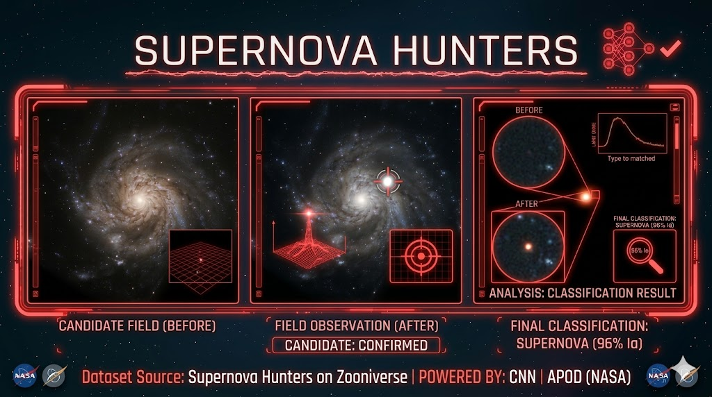

# [Supernova Hunters](https://github.com/MonicaCheely/supernova-hunters)

[](https://github.com/MonicaCheely/supernova-hunters)

## Project Overview
This project analyzes **astronomical observation data** to detect potential supernova events. Using data science and machine learning techniques, it identifies transient celestial phenomena and classifies them based on observational patterns.

### Key Features
- Explore and preprocess astronomical observation datasets  
- Detect patterns in transient events  
- Apply machine learning models to classify supernova candidates  
- Visualize detected events and analyze statistical trends

### Skills & Tools
- Python, Pandas, NumPy  
- Matplotlib & Seaborn for visualization  
- Scikit-learn for machine learning  
- Jupyter notebooks for experimentation  
- Git/GitHub for version control

### Future Work
- Include more observational datasets from additional surveys  
- Improve detection accuracy with advanced ML models  
- Build a web dashboard to visualize supernova detections interactively

### How to Run
1. Clone the repository:  
   ```bash
   git clone https://github.com/MonicaCheely/supernova-hunters.git
